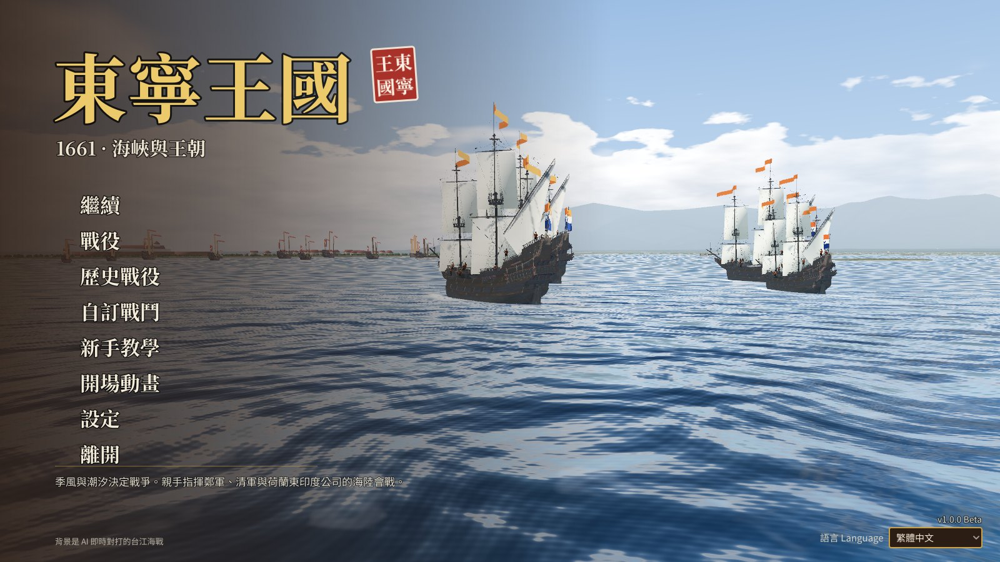
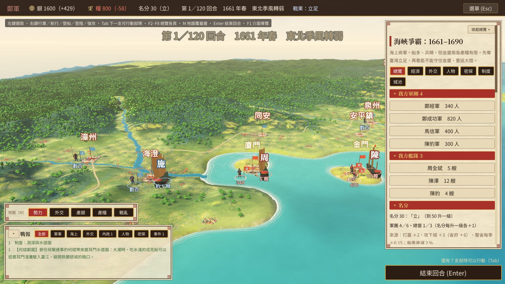
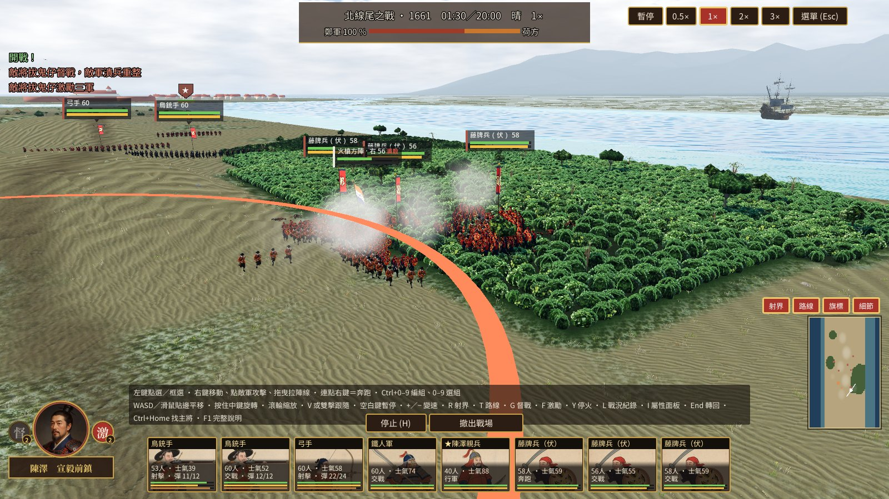
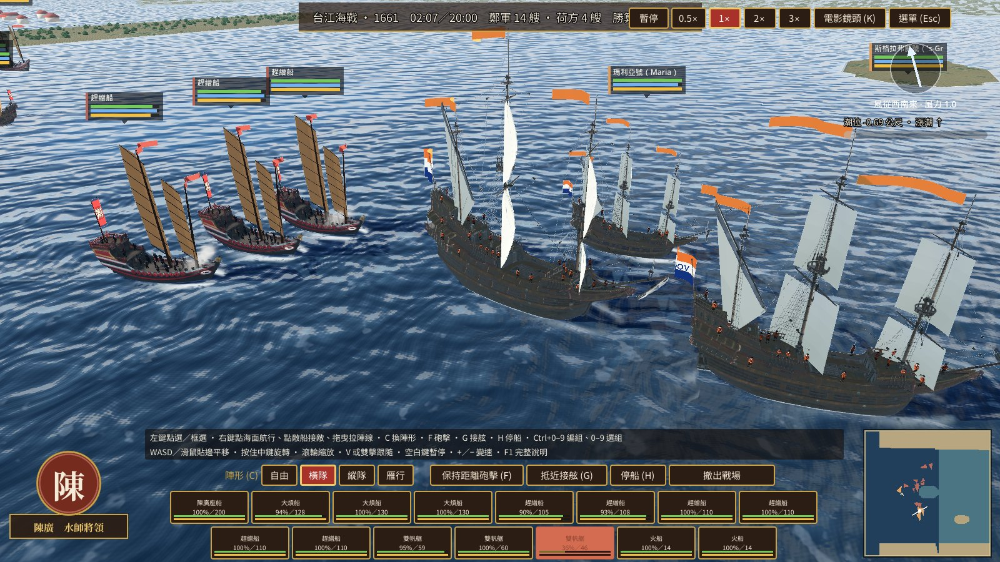

<h1 align="center">東寧王国　Kingdom of Dongning</h1>

<b>1661 · 海峡と王朝</b>　｜　公開ベータ版 v1.0.0　｜　Windows 64 ビット

<a href="README.md">繁體中文</a> ·
<a href="README.en.md">English</a> ·
<b>日本語</b>

---

1661 年、明の天下に残されたのは海だけだった。鄭成功は艦隊を率いて黒水溝を越え、オランダ東インド会社から台湾を奪おうとする——
それから三十年、東寧は季節風、清朝、三藩、そして海上交易のはざまで生き残りをかけた。

『東寧王国』は明鄭時代の台湾（1661–1690）を舞台にした戦略ゲームです。**ターン制の戦略マップ**と**リアルタイムで指揮する陸戦・海戦**を組み合わせています。
マップでは軍を動かし、船を造り、交易を営み、人心の向背に向き合います。両軍がぶつかれば、自動解決にすることも、自ら戦場に降りて
藤牌兵、鉄人軍、火縄銃隊、そして福船の艦隊を指揮することもできます。

> これは**公開ベータ版**です。最初から最後まで遊べますが、バランス・インターフェース・翻訳はまだ調整中で、バグも必ずあります。
> ぜひ遊んで、見つけたことを教えてください。皆さんの報告が次のバージョンで何を直すかを決めます。

## ダウンロードと起動

1. [Releases](../../releases) から `KingdomOfDongning-1.0.0-beta-win64.zip` をダウンロードします。
2. 任意のフォルダーに展開します。**zip の中から直接起動しないでください。**
3. `KingdomOfDongning.exe` を実行します。

- インストーラーはなく、レジストリにも何も書き込みません。アンインストールはフォルダーを削除するだけです（セーブデータは別の場所にあります。「セーブとログ」を参照）。
- 実行ファイルにはデジタル署名がないため、初回に「Windows によって PC が保護されました」と表示されることがあります。「詳細情報」→「実行」を押してください。
- 最初の戦闘ではシェーダーのコンパイルのため数秒カクつくことがありますが、その後は滑らかになります。

## 動作環境

| | 最低（推定） | 開発時のテスト環境 |
|---|---|---|
| OS | Windows 10／11 64 ビット | Windows 11 |
| グラフィック | Vulkan 対応の独立 GPU（GTX 1060 クラス以上） | NVIDIA RTX 5060 Ti 16GB |
| メモリ | 8 GB | 48 GB |
| ストレージ | 約 1 GB の空き容量（展開後 0.9 GB） | |

現時点では**中〜上位の GPU 1 枚でしかテストしていません**。エントリー向け GPU や内蔵グラフィックスでの動作はまだ分かりません。
重い場合は「設定」で「3D解像度」「影の品質」「部隊ごとの表示人数」を下げるか、「戦場環境の細部描写」をオフにしてください。
GPU の型番と FPS を教えていただけると大変助かります。

## ゲーム内容

- **キャンペーン**（ターン制戦略マップ＋リアルタイム戦闘）
  - **台湾遠征（1661–1662）**：短いシナリオ。鄭軍または清軍。海を渡って台湾を攻め、ゼーランディア城を包囲しつつ、金門・廈門を守ります。
  - **海峡争覇（1661–1690）**：メインキャンペーン。鄭軍・清軍・オランダ東インド会社。遷界令、五商と海外交易、名分と国統、人物と継承、三藩の乱。
  - **天下：三藩の乱（1674–1690）**：大マップ。清軍・呉周・鄭軍。
  - 難易度 3 段階（平易／標準／困難）、歴史設定 3 種（史実／演義／架空）。
- **歴史会戦**：鹿耳門上陸、北線尾、台江の海戦、ゼーランディア城、澎湖の海戦——史実の順に並んだ 5 つの会戦。どちらの陣営でも遊べ、チャレンジ目標があります。
- **カスタムバトル**：自分で軍を編成し、野戦・攻城戦・上陸戦・海戦を選べます。
- **チュートリアル**：約 10 分でカメラ、選択、陣形、部隊グループ、伏兵、攻撃を覚えられます。
- 表示言語：繁體中文、简体中文、English、日本語（メインメニュー右下で切り替え）。
  英語・日本語は中国語版からの翻訳です。訂正があればぜひお知らせください。

### 画面

<table>
<tr>
<td width="50%" align="center"> <b>メインメニュー</b> 背景は AI 同士がリアルタイムで戦う台江の海戦</td>
<td width="50%" align="center"> <b>戦略マップ（ターン制）</b> 海峡争覇の第 1 ターン：金門・廈門の軍団と艦隊、右は概要パネル</td>
</tr>
<tr>
<td width="50%" align="center"> <b>陸戦（リアルタイム）</b> 北線尾の戦い：藤牌兵が茂みから飛び出し、オランダの銃兵方陣を伏撃</td>
<td width="50%" align="center"> <b>海戦（リアルタイム）</b> 台江の海戦：鄭軍の趕繒船が横隊でオランダ船を迎え撃つ</td>
</tr>
</table>

## 操作説明

| | 戦略マップ | 陸戦／海戦 |
|---|---|---|
| 選択 | 左クリック | 左クリック、ドラッグで範囲選択、Ctrl+A で全選択 |
| 命令 | 右クリック（行軍・航行・上陸・強襲） | 右クリックで移動／攻撃、右ドラッグで戦列を引く、右ダブルクリック＝走る |
| カメラ | WASD、マウスホイール、中ボタンドラッグ | WASD、Q／E 回転、Z／X 俯仰、マウスホイール、中ボタンドラッグ |
| その他 | Enter でターン終了、Tab で次の部隊、F2–F8 で概要 | スペースで一時停止（停止中も命令可能）、＋／− で速度変更 |
| ヘルプ | F1 | F1（操作説明）、Esc でメニュー |

> **ゲーム中はいつでも F1 で操作説明の全文が見られます**（戦略マップ・陸戦・海戦それぞれ。戦闘中は Esc メニューからも）。
> 初めての方は、メインメニューの **「チュートリアル」** から始めてください（約 10 分。選択・布陣・開戦・伏兵を順に練習します）。新しいキャンペーンでも最初の数手をガイドが案内します。
> 戦場の左下にある操作のヒントはクリックで折りたたみ・展開できます。

### 戦略マップ（ターン制）

- 【ターン】Enter でターン終了 · F1 画面ガイドと説明 · Esc メニュー（セーブ・ロード・設定）
- 【選択】軍団・艦隊・城を左クリック · Tabで行動可能な部隊を順に選択 · Escで選択解除
- 【命令】軍団を選択してマップを右クリック＝行軍（金色の範囲は1ターンで到達可能、赤＝戦闘になる）
  - 自軍の艦隊を右クリック＝乗船。乗船中の軍団で隣接する陸地を右クリック＝上陸（敵軍がいれば強襲上陸）
  - 隣接する敵の城を右クリック＝強襲（自動解決のみ）。城の隣で動かずにいる＝包囲
- 【海上】艦隊を選択して海面を右クリック＝航行。季節風に逆らうと移動コストが倍。敵要塞に隣接する海域を通ると砲撃を受ける
  - 鹿耳門浅瀬は水路図がないと通れない（第1ターンに何斌が水路図を献上する）
- 【補給線】自領の外に出た軍団は自軍の城とつながっている必要がある（陸路5マス以内、または敵艦隊に遮られない海路）。途切れると毎ターン兵が損耗する
  - 海峡争覇：出陣前に軍団パネルで「携行兵糧を積む」と、補給線が断たれたとき先に携行兵糧を消費する。国庫に余裕があれば三軍を労ったり（士気）、城壁を修築したり（拠点パネル）もできる
- 【包囲】港湾都市は艦隊で海上を封鎖しないと、敵艦が海から補給してしまう。兵糧が尽きれば守備隊は崩れて降伏する
- 【総覧】F2 総覧 · F3 経済 · F4 外交 · F5 人物 · F6 密偵 · F7 制度 · F8 城（シナリオにない制度のページは出ない。同じキーをもう一度押すと閉じる）· Ctrl+S クイックセーブ、Ctrl+L クイックロード
- 【戦報】左下のタブ：軍事・海上・外交・内政・人物・密偵・イベント（タブの数字＝このターンの新着）。末尾に「›」がある項目をクリックすると、カメラが現場へ移動する
- 【マップ】Mキーまたは左下のボタンでオーバーレイを切替：勢力・外交（あなたとの関係）・銀の産出・兵糧の産出（城名の下に毎季の量）・戦乱（包囲・反乱・封鎖・遷界令）
- 【カメラ】WASD／マウスを画面端に寄せて移動 · Q/Eで回転 · ホイールでズーム · Homeで選択中の部隊へ（未選択なら君主）· Endで北向きに戻す · Ctrl+F9–F12 で視点を記録、F9–F12 で呼び出し · スペース長押しで外交 · Ctrl+T で名札の表示切替

### 陸戦（リアルタイム）

- 【選択】部隊か旗印を左クリック · 左ドラッグで範囲選択 · Shift で追加選択 · Ctrl+A で全選択 · 下部のユニットカードをクリック
- 【グループ】Ctrl+0–9 で選択中の部隊をグループに登録 · 0–9 でそのグループを選択（Shift で追加）· 2回続けて押す＝カメラがそこへ移動
- 【命令】地面を右クリック＝移動 · 敵を右クリック＝攻撃 · 右ドラッグ＝戦列を敷く（幅と向きを決める）· 右ダブルクリック＝駆け足
  - H 停止 · Y 射撃中止（命じた目標だけを撃つ。伏兵は撃つと姿を現すので、敵が近づくまで撃たない）· Backspace も停止（撤退はボタンで）· 配置段階：黄色の区域に布陣、Enter で開戦
- 【カーソル】赤い双刀付きの矢印＝右クリックでこの目標を攻撃 · 指＝左クリックで選択できる · 太い矢印＝その方向へスクロール中
- 【疲労】駆け足・敗走・白兵戦で疲れ、止まって休むと回復する（歩くだけならほとんど疲れない）· 疲弊：移動が遅くなり、白兵戦で当たりにくく、士気が下がる · 疲労困憊：走れず、右ダブルクリックしても歩くだけ
  - 鉄人軍など重装の兵は疲れやすく、騎兵は疲れにくく、雨天はさらに疲れる。ユニットカードに「疲弊／疲労困憊」と表示される。遠くの敵には歩いて近づき、余力を残して最後の一区間だけ走るとよい
- 【カメラ】WASD／方向キーかマウスを画面端に寄せて移動（Shift で加速）· Q／E 回転 · Z／X 上下の傾き · 中ボタン（ホイール）を押したままドラッグ＝回転と傾き
  - ホイールでズーム（最大まで寄ると地上視点）· V か部隊をダブルクリック＝追尾 · Home で自軍の戦列へ戻る · ミニマップをクリックで移動
- 【時間】スペースキーで一時停止（停止中も命令できる）· +／− で速度変更
- 【旗印】緑のバー＝兵力、黄色のバー＝士気（開戦時との比較）。士気が尽きると部隊は敗走する。武将が近くにいれば士気が安定する
- 【コツ】銃兵は接近戦と側面・背後に弱い。藤牌兵は正面で弾を防ぐ。茂みの中で静止した部隊は潜伏する。雨天は火縄銃がよく不発になる
- 【地形】Alt を押している間：潜伏できる茂みの範囲を表示（黄緑の枠線。配置中と戦列を敷くときは自動表示）
- 【表示】選択中の射手は射界を扇形で表示（撃てるのは正面のこの範囲だけ：銃 ±50°、弓 ±70°、砲 ±35°。射程は高低差で変わり、坂の下へ・城壁の上からは遠くまで届く）、射撃中の目標には赤い破線 · R で切替
- 【主将】左下は主将の肖像：クリックで主将隊を選択、ダブルクリックで追尾。両脇の丸ボタン＝主将の技能、1戦闘につき各2回、使用後はクールタイムあり——
  - 督（G）督戦：主将の近くで敗走中の部隊をただちに立て直す · 激（F）鼓舞：主将の近くの部隊の士気がしばらく大きく上がる · 主将が敗走・戦死すると使えない（敵将も使ってくる）
- 【部隊能力】部隊を選択すると「停止」の左に丸ボタンが出る：火＝弓兵が火矢に切り替え（士気への打撃が大きく藤牌を焼くが、装填が遅い。雨天は不可）· 突＝藤牌兵の滾牌突撃（速く、銃弾や矢が当たりにくい）· 斬＝鉄人軍が斬馬の構え（突撃を止め、騎兵を斬る）
- 【射界】待機中の射撃部隊は自分では向きを変えない：敵が側面や背後に回ったら、右ドラッグで戦列を引き直して向きを変えるか、敵を右クリックして攻撃を命じる（部隊は目標の方へ向き直る）
  - 選択中の部隊の行軍経路を表示（城壁の迂回や城門の通過での曲がり角も。薄緑＝行軍、赤＝攻撃）· T で切替
- 【上陸】船上の部隊を選び（下部のカード）、上陸地点の近くを右クリックするか、パネルの上陸地点ボタンを押す。小艇には限りがあり、乗れない部隊は次の便を待つ。潮が引くと、船上に残った部隊は上陸できない
- 【艦砲】「艦砲斉射」を押してから目標を左クリック（右クリックで取消）。砲弾の散布が大きく、味方を巻き込むこともある。赤い円はまもなく着弾する位置
- 【攻城】据え付けた砲台は移動できず、射撃目標の指定のみ可能。城壁の突破口から攻め込み、城内の拠点を確保すれば勝利

### 海戦（リアルタイム）

- 【選択】船かバナーを左クリック · 左ドラッグで範囲選択 · Shift で追加選択 · Ctrl+A で全選択 · 下部の船カードをクリック
- 【グループ】Ctrl+0–9 で選択中の船をグループに登録 · 0–9 でそのグループを選択（Shift で追加）· 2 回続けて押す＝カメラがそこへ移動
- 【命令】海面を右クリック＝航行（航路は黄色の線）· 敵船を右クリック＝接敵（赤い線）
- 【陣形】下のボタンか C：自由／横隊／縦隊／雁行。2 隻以上を選択中は——海面を右クリック＝陣形航行（最も遅い船の速度にそろえて進み、到着したら整列して正面を向く）
  - 敵船を右クリック＝陣形接敵（隊列を保って接近し、最も近い船が射程の外縁に達したら一斉に突入）· 右ドラッグ＝陣線を引く（横隊・雁行は正面の幅、縦隊はドラッグした方向に一列に並ぶ）
  - F 距離を保って砲撃 · G 接近して接舷 · H／Backspace 停船 · 撤退はボタンで
- 【カーソル】赤い双刀付きの矢印＝右クリックで接敵 · 指差し＝左クリックで選択できる · 太い矢印＝その方向へスクロール中
- 【動けない？】接舷中の船は鉤縄でつながれており、白兵戦の決着がつくか相手が鉤縄を切るまで動けない。座礁した船は満ち潮を待つしかない。向かい風ではジグザグに間切って進むので、遅いのは正常
- 【風と潮】右上の羅針盤が風向き。船は風上へまっすぐには進めない。船を選択中の赤い水域＝現在の潮位では座礁する
- 【カメラ】WASD／方向キーかマウスを画面端に寄せて移動（Shift で加速）· Q／E 回転 · Z／X 上下の傾き · 中ボタン（ホイール）を押したままドラッグ＝回転と傾き
  - K シネマカメラ（海面すれすれで最も激しい交戦地点をゆっくり周回し、UI はすべて非表示。K か Esc で戻る）
  - ホイールでズーム（最大まで寄る＝甲板視点）· V か船をダブルクリック＝追尾 · Home で艦隊へ戻る · ミニマップをクリックでジャンプ
- 【バナー】緑＝船体、青＝船員、黄＝士気。船員か士気が尽きると降伏する
- 【時間】スペースキーで一時停止（停止中も命令できる）· +／− で速度変更

## 不具合の報告

[Issues](../../issues) で新しい報告を作り、「バグ報告」または「提案」のテンプレートを選んで記入してください。
**プログラミングの知識は不要です。**「何をしたか、何が起きたか、どうなると思っていたか」だけで十分役に立ちます。

あると助かる添付物：

1. **バージョン**：メインメニュー右下（例：`v1.0.0 Beta`）。
2. **スクリーンショット**：`Win + Shift + S`。
3. **ログファイル**：`%APPDATA%\Godot\app_userdata\Dongning\logs\godot.log`
   （エクスプローラーのアドレスバーに `%APPDATA%\Godot\app_userdata\Dongning\logs` を貼り付けて Enter、`godot.log` を報告にドラッグしてください）。
4. キャンペーンに関する問題では**セーブデータ**：`%APPDATA%\Godot\app_userdata\Dongning\campaign\` の最新の `.json`。

## セーブとログ

| | 場所 |
|---|---|
| キャンペーンのセーブ・オートセーブ | `%APPDATA%\Godot\app_userdata\Dongning\campaign\` |
| 設定 | `%APPDATA%\Godot\app_userdata\Dongning\settings.json` |
| ログ | `%APPDATA%\Godot\app_userdata\Dongning\logs\` |

ベータ版の間では**セーブデータの互換性は保証しません**。アップデート後に古いセーブが読めない場合は新しく始めてください
（ゲームは「ロードに失敗した」と表示し、他のセーブデータを壊すことはありません）。

## 既知の問題

各バージョンの[リリースノート](../../releases)をご覧ください。

## ライセンス

- このリポジトリには**ゲームの実行ファイルと説明書**だけを置いています。ゲームのソースコードは非公開です。
- ベータ版は無料でダウンロード・プレイ・録画・配信できます（大歓迎です！）。改変しての再配布や販売はご遠慮ください。詳しくは [LICENSE.md](LICENSE.md) を参照してください。
- ゲームが使用しているサードパーティのソフトウェア・フォント・素材とそのライセンスは [THIRD_PARTY_NOTICES.md](THIRD_PARTY_NOTICES.md) にあります。

## 歴史について

ゲームは実際の歴史を骨格にしています（人物・事件・城・艦船・兵種は史料に基づき、シナリオデータに出典を記しています）。
ただし遊べるようにするため、数値や一部の細部は推定と取捨選択によるもので、「演義」「架空」設定の展開は史実ではありません。
史実の誤りに気づいたら、それもぜひ報告してください。

---

© 2026 liliyeh

